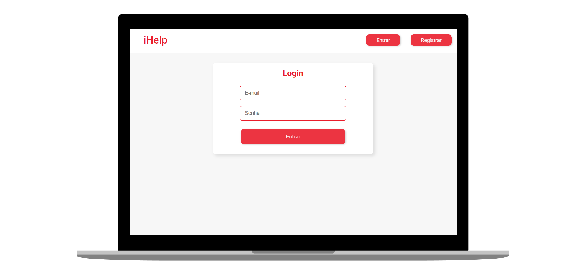

<h1 align="center">
    
</h1>

<h3 align="center">
  iHelp
</h3>

 
 

  <a href="#sobre">Sobre</a>&nbsp;&nbsp;&nbsp;|&nbsp;&nbsp;&nbsp;
  <a href="#tecnologias">Tecnologias</a>&nbsp;&nbsp;&nbsp;|&nbsp;&nbsp;&nbsp;
  <a href="#licença">Licença</a>

  

## Sobre 

'iHelp' é um projeto desenvolvido para a Global Solution do segundo semestre do curso de Análise e Desenvolvimento de Sistemas na FIAP. Trata-se de um sistema web, criado através do framework Spring. 
O projeto visa a conexão entre potenciais doadores de alimentos e pessoas que se encontram em situação de insegurança alimentar, usuários solidários podem se cadastrar e fazer o transporte dos pedidos através da plataforma. 

#### Integrantes do grupo:
Carolina Gomes da Silva - RM85183  
Élida Coelho da Silva - RM85599  
João Carlos Silva Muniz - RM86392  
Luana Cunha Hitomi Maruya e Silva - RM86039  
Maurício Martins - RM86035  
Pedro Miguel de Sousa Barbosa dos Santos - RM86396

## Tecnologias

Esse projeto foi desenvolvido com as seguintes tecnologias:

- [Spring Framework](https://spring.io/)
- [Thymeleaf](https://www.thymeleaf.org/)
- [Maven](https://maven.apache.org/)
- [Lombok](https://projectlombok.org/)
- [JPA](https://spring.io/projects/spring-data-jpa)

## Licença

Esse projeto está sob a licença MIT. Consulte o arquivo [LICENSE](https://github.com/pedromiguelsbs/iHelp/blob/main/LICENSE) para mais detalhes.
